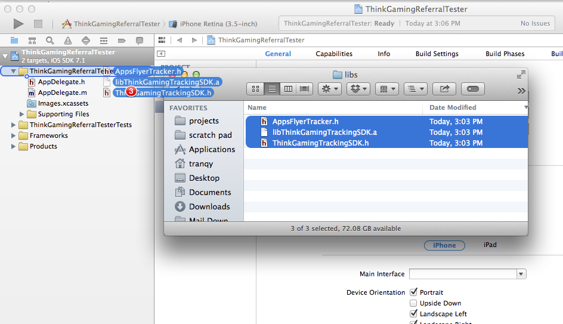
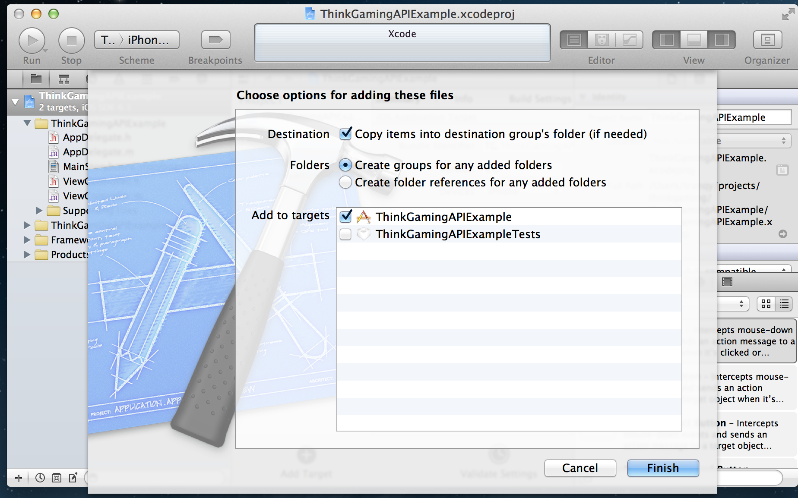
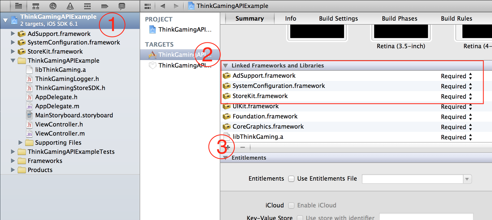

#Think Gaming iOS Quick Start

Think Gaming's SDK provides integration with both the Think Gaming platform and Apple's StoreKit. Integrating the SDK into your iOS app is quick and simple.

##Download the SDK
Download the SDK here, and then extract it.

##Integrate the SDK into your iOS app.

1. Drag the .a and h files into your project.


2. Add the files to your project.


3. Add the following Libraries 
	* AdSupport.framework
	* iAd.framework


##Start using the Store SDK


####Initialize the SDK with your API key. We recommend you do this in your app delegate.

* Open your app delegate.
* Find where you initialize the ThinkGamingLoggingSDK. 
* Add a line to init the tracking logger. Please work with your implementation team to find your DevKey and AppId

```Objective-C
#import "ThinkGamingLogger.h"

[ThinkGamingLogger startSession:@"ThinkGamingApiKey"];
[ThinkGamingTrackingSDK startSessionWithDevKey:@"DevKey" appId:@"AppId"];


```

## Remember
Using the Tracking SDK also requires use of the Logging SDK. Please ensure the logging SDK is functional before adding the Tracking SDK.